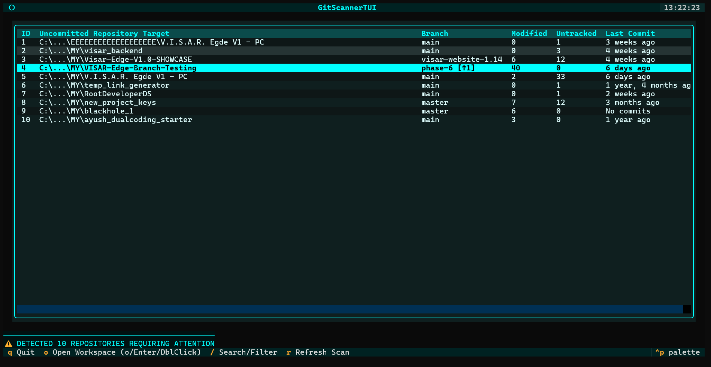
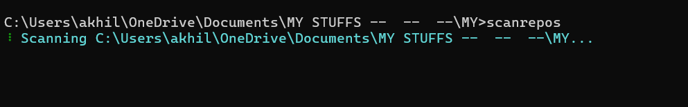
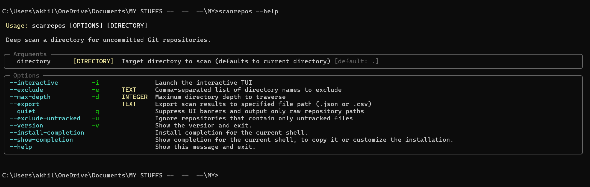

# 🔍 Git Uncommitted Scanner (`scanrepos`)


[](https://badge.fury.io/py/git-uncommitted-scanner)


**A high-speed, cross-platform CLI & TUI utility that recursively deep-scans your filesystem to instantly locate Git repositories with pending uncommitted changes.**

---

## ⚡ Why `git-uncommitted-scanner`?

Tired of discovering forgotten, uncommitted code changes in scattered workspace folders months later? `git-uncommitted-scanner` recursively hunts down pending changes across your entire filesystem with asynchronous speed, presenting them in either a clean CLI table or a high-tech interactive Terminal User Interface (TUI).

<p align="center">
  
</p>

---

## 📦 Installation

Choose the installation method that fits your environment:

### Method 1: Recommended for CLI tools (`pipx` / `uv`)
`pipx` and `uv` automatically isolate dependencies and ensure binary executable scripts are added to your system `PATH`:

```bash
# Using pipx (Recommended - automatically configures PATH)
pipx install git-uncommitted-scanner
pipx ensurepath

# Or using uv
uv tool install git-uncommitted-scanner

# Or run instantly without installing:
uvx git-uncommitted-scanner
```

### Method 2: Standard `pip`
```bash
pip install git-uncommitted-scanner
```

> [!TIP]
> **Can't find the `scanrepos` command after installing?**  
> You can **always** run the scanner directly through Python without modifying your PATH:
> ```bash
> python -m git_scanner
> ```
> See the [Troubleshooting & PATH Fix](#-troubleshooting--faq) section below to permanently add `scanrepos` to your terminal.

---

## 🚀 Usage

You can run the scanner using either `scanrepos` or `python -m git_scanner`:

### 1. Standard CLI Mode
Run a rapid background scan that outputs a styled `Rich` table listing all uncommitted repositories along with branch names, modified file counts, untracked counts, and last commit age.

```bash
# Scan the current directory
scanrepos

# Scan a specific directory path
scanrepos /path/to/your/projects

# Limit search depth to 3 levels
scanrepos /path/to/projects -d 3

# Exclude specific folders (e.g. node_modules, build, vendor)
scanrepos /path/to/projects -e "vendor,build"

# Ignore repositories with only untracked files (clean worktrees)
scanrepos -u

# Scripting / Automation: Output ONLY raw paths (ideal for xargs, pipelines, CI/CD)
scanrepos -q

# Check installed version
scanrepos --version

# View all CLI options and flags
scanrepos --help

# Export results to JSON or CSV (format auto-detected by extension)
scanrepos /path/to/projects --export scan_results.json
scanrepos /path/to/projects --export scan_results.csv
```

<p align="center">
  
</p>

<details>
<summary><b>📖 Click to preview full CLI Options & Flags (<code>scanrepos --help</code>)</b></summary>
<br>
<p align="center">
  
</p>
</details>

### 2. Interactive TUI Mode (`-i`)
Launch the Neon-Cyan Terminal User Interface. Navigate repositories with keyboard arrows, double-click or press <kbd>Enter</kbd> to spawn a native shell terminal directly inside the highlighted workspace.

```bash
# Launch TUI in the current directory
scanrepos -i

# Launch TUI with custom path, depth limits, and exclusions
scanrepos -i /path/to/your/projects -e "vendor,temp" -d 4
```

#### TUI Keyboard & Mouse Controls:
* **Column Header Click**: Click any column header to sort ascending (▲) / descending (▼) by ID, Path, Branch, Modified, Untracked, or Last Commit.
* <kbd>/</kbd> or <kbd>s</kbd> : Toggle live search/filter bar to filter repositories by name or branch in real time.
* <kbd>Escape</kbd> : Close/dismiss search bar and restore focus to the repository table.
* <kbd>Enter</kbd> / Double-Click / <kbd>o</kbd> : Spawn native OS terminal (`wt`, `pwsh`, `cmd`, `iTerm2`, `Terminal.app`, `gnome-terminal`, `alacritty`, `kitty`, etc.) in the selected repository.
* <kbd>r</kbd> : Trigger an asynchronous re-scan of the target folder.
* <kbd>q</kbd> : Quit the application.

---

### 3. Configuration File Support (`.gitscannerrc` / `pyproject.toml`)
You can define persistent default exclusions and search depth in `~/.gitscannerrc`, `.gitscannerrc`, or `pyproject.toml`:

```ini
# .gitscannerrc
[gitscanner]
exclude = vendor, temp, test_env, cache
max_depth = 4
```

Or in `pyproject.toml`:
```toml
[tool.gitscanner]
exclude = ["vendor", "temp", "cache"]
max_depth = 4
```

---

## ✨ Key Features

* **⚡ Generative Concurrency & Deep Scanning**: Traverses nested folder trees using iterative `os.scandir` DFS pruning and pipelines discoveries straight into a multi-threaded `ThreadPoolExecutor` (up to 32 concurrent workers), overlapping disk I/O with subprocess execution.
* **🖥️ Interactive Neon-Cyan TUI**: Built with customized `Textual` components, providing smooth keyboard navigation, zebra striping, and automatic table focus on scan completion.
* **📊 Bi-Directional Interactive Column Sorting**: Click any column header or navigate to toggle ascending (▲) and descending (▼) sort order by ID, Path, Branch, Modified files, Untracked files, or chronological Last Commit timestamp.
* **🔍 Real-Time Live Search Overlay**: Press <kbd>/</kbd> or <kbd>s</kbd> to filter large project lists by repository path or branch in real time; dismiss with <kbd>Escape</kbd> to return to table navigation.
* **🌐 Upstream Synchronization Telemetry**: Parses remote tracking branches to display live ahead/behind indicators (`[↑X ↓Y]`), alerting you immediately when local commits need pushing or upstream changes need pulling.
* **💻 OS-Aware Native Terminal Launcher**: Highlight any uncommitted repository in the TUI and press <kbd>Enter</kbd>, double-click, or press <kbd>o</kbd> to spawn a native shell running `git status` inside that folder (auto-detects Windows Terminal `wt`, PowerShell 7 `pwsh`, `cmd`, macOS `iTerm2`/`Terminal.app`, Linux `gnome-terminal`, `alacritty`, `kitty`, `konsole`, etc.).
* **🤖 Script Automation & Quiet Mode**: Added `--quiet` (`-q`) mode to suppress all rich spinners and tables, outputting only raw, newline-delimited paths for seamless piping into `xargs`, shell scripts, or CI/CD pipelines.
* **🎯 Granular Noise Reduction**: Ignore repositories with only untracked files (`-u` / `--exclude-untracked`), exclude custom directory blacklists (`-e`), and limit traversal recursion depth (`-d`).
* **📄 Dual JSON & CSV Data Export**: Automatically infers and exports scan data to either structured JSON (`.json`) or spreadsheet-friendly CSV (`.csv`) via `--export`.
* **⚙️ Persistent Configuration**: Define global or project defaults in `~/.gitscannerrc`, `.gitscannerrc`, or `pyproject.toml`.
* **🌳 Submodule & Worktree Support**: Accurately recognizes both standard `.git` directories and `.git` pointers (submodules and git worktrees).
* **🛡️ Zero-Config Module Execution**: Built-in `python -m git_scanner` runner ensures the app runs anywhere, even on restricted or shared lab PCs where Python's `Scripts/` folder is not on system `PATH`.
* **🪶 Zero Dependencies Bloat**: Pure Python standard library logic alongside `typer`, `rich`, and `textual` — no heavy C extensions or bloatware.

---

## 🛠️ Technology Stack

* **Core Engine**: Python `>=3.9`, standard `subprocess`, `pathlib.Path`
* **CLI Routing**: [`Typer`](https://typer.tiangolo.com/)
* **Terminal Formatting**: [`Rich`](https://rich.readthedocs.io/)
* **Interactive TUI**: [`Textual`](https://textual.textualize.io/)
* **Build System**: `setuptools` (PEP 621 compliant)

---

## 🤖 Agent Ecosystem & Developer Guidelines

This repository includes a structured multi-agent automation setup for continuous maintenance:

* [`AGENTS.md`](AGENTS.md) — Mandatory developer & autonomous agent guidelines, zero-fake-progress rules, and PR formatting standards.
* [`prompt-bolt.md`](prompt-bolt.md) — **GitScanner Bolt ⚡** (Performance & scan speed optimizer prompt).
* [`prompt-evo.md`](prompt-evo.md) — **GitScanner Evo 🚀** (Product feature evolution prompt).
* [`prompt-pallete.md`](prompt-pallete.md) — **GitScanner Palette 🎨** (TUI & CLI UX evolution prompt).
* [`.coderabbit.yaml`](.coderabbit.yaml) — Assertive automated PR code review rules.
* **Target PR Branch**: `Dev2Auto`

---

## 🔧 Troubleshooting & FAQ

### `'scanrepos' is not recognized as an internal or external command`

This occurs when Python installs command-line scripts to your user directory (common on shared, lab, or school PCs where administrator rights are restricted), but that directory has not yet been added to your system `PATH`.

#### Quick Fix 1: Run via Python directly (Works instantly, no setup needed)
```bash
python -m git_scanner
```
*(or `python -m git_scanner -i` for TUI mode)*

#### Quick Fix 2: Reinstall with `pipx` (Recommended)
`pipx` automatically isolates CLI tools and configures your PATH:
```bash
pip install pipx
pipx ensurepath
pipx install git-uncommitted-scanner
```

#### Quick Fix 3: Add Python Scripts to your PATH manually

* **Windows (PowerShell)**:
  Run this one-liner in PowerShell to permanently add Python Scripts to your user PATH:
  ```powershell
  [Environment]::SetEnvironmentVariable("PATH", $env:PATH + ";$((py -c 'import site; print(site.USER_BASE)') + '\Scripts')", "User")
  ```
  Then restart your terminal.

* **Linux / macOS**:
  Add Python bin to your `~/.bashrc` or `~/.zshrc`:
  ```bash
  export PATH="$HOME/.local/bin:$PATH"
  ```
  Then reload your shell (`source ~/.bashrc` or `source ~/.zshrc`).

---

## 📜 Version History & Release Notes

For a complete record of all updates, bug fixes, and feature additions across releases, please refer to the **[`CHANGELOG.md`](CHANGELOG.md)**.

---

Built with ❤️ by [RootDeveloperDS](https://github.com/RootDeveloperDS)
